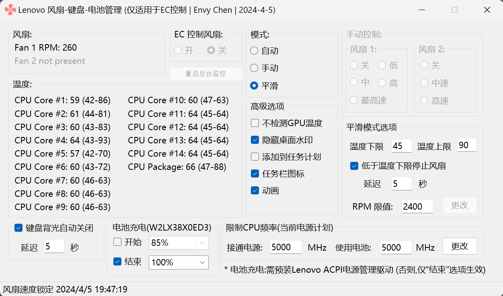

# LenovoFanManagement （中文版）

Windows Desktop App. to manage Lenovo Fan RPM special for Thinkpad E16 gen 1 ，but it might works with other type of Thinkpad.
- OS: Windows 10 / 11
- Platform: x64

This project is based on [ec_tpfan](https://github.com/simonchen/ec_tpfan)

## 功能简述

### 平滑模式



- 设置温度下限， 勾选低于温度下限停止风扇 + 延迟 (CPU温度低于下限时风扇停转）
- 设置温度上限，(CPU温度超过上限，将开启最高风速)
- 其余情况EC自动调节
  
### 手动模式


- 关: 风扇停止，**危险！CPU温度升高也不会自动启动风扇！**
- 低：风扇转速 2500 RPM
- 中：风扇转速 3100 RPM
- 高：风扇转速 4400 RPM
- 最高速: 风扇转速 5700 RPM

### 允许测试签名 (Ttest signing ON）
LenovoFan.exe需要加载驱动程序，为防上不能正常加载，请执行下命命令，允许测试签名：
```
bcdedit -set TESTSIGNING ON
```
**注意：** BitLock如果打开，重启完重启后，将会问密钥进入！（**请预先备份BitLock密钥到u盘**）

### 添加到任务计划 (v1.1)
v1.1版本及以后，推荐使用，一键打开/关闭。
- 以管理员权限运行
- 登录时运行
- 每分钟自动检测/重启
- 运行在交流电源或电池模式

### 系统启动时运行 (v1.0)
LenovoFan.exe 需要获取管理员权限才能正常运行，建议执行下面UAC命令，调整为“从不通知”，
可以避免每次系统启动时提示需要管理员权限运行。
···
C:\Windows\System32\UserAccountControlSettings.exe
···

## Workflow build
You can manually build the solution by implementing actions,
Note: [How to set write permission](https://stackoverflow.com/questions/70435286/resource-not-accessible-by-integration-on-github-post-repos-owner-repo-ac)
```
Go to repository "Settings".
After that it will show you a left pane where you will find "Actions"
Expand "Actions" tab
Click on "General" under options tab.
Now on new page scroll down and you will fine "Workflow Permissions"
Select "Read and Write" under "Workflow Permissions".
```
